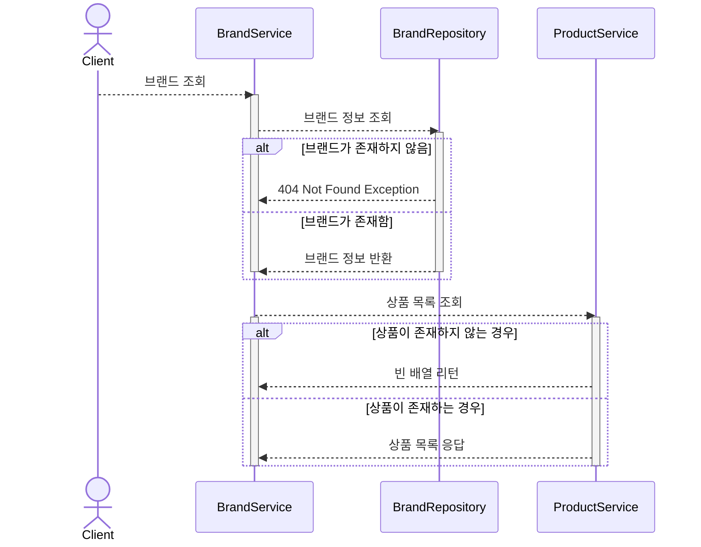

# 시퀀스 다이어그램

## 브랜드
### 브랜드 조회

```mermaid
sequenceDiagram
    actor U as Client
    participant BS as BrandService
    participant BP as BrandRepository
    participant PS as ProductService
    
    U -->> BS: 브랜드 조회
    activate BS
    BS -->> BP: 브랜드 정보 조회
    activate BP
    alt 브랜드가 존재하지 않음
    BP -->> BS: 404 Not Found Exception
    else 브랜드가 존재함
    BP -->> BS: 브랜드 정보 반환
    deactivate BP
    deactivate BS
    end
    BS -->> PS: 상품 목록 조회
    activate BS
    activate PS
    alt 상품이 존재하지 않는 경우
        PS -->> BS: 빈 배열 리턴
    else 상품이 존재하는 경우
        PS -->> BS: 상품 목록 응답
    end
    deactivate BS
    deactivate PS
    
```


```
