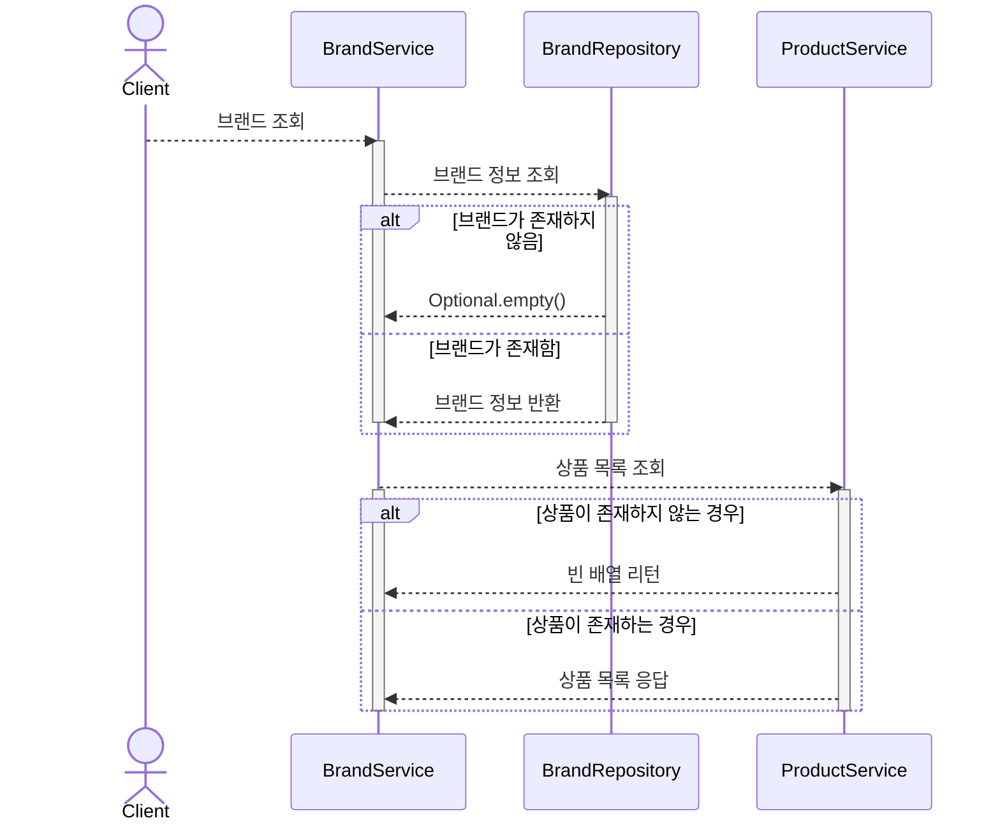
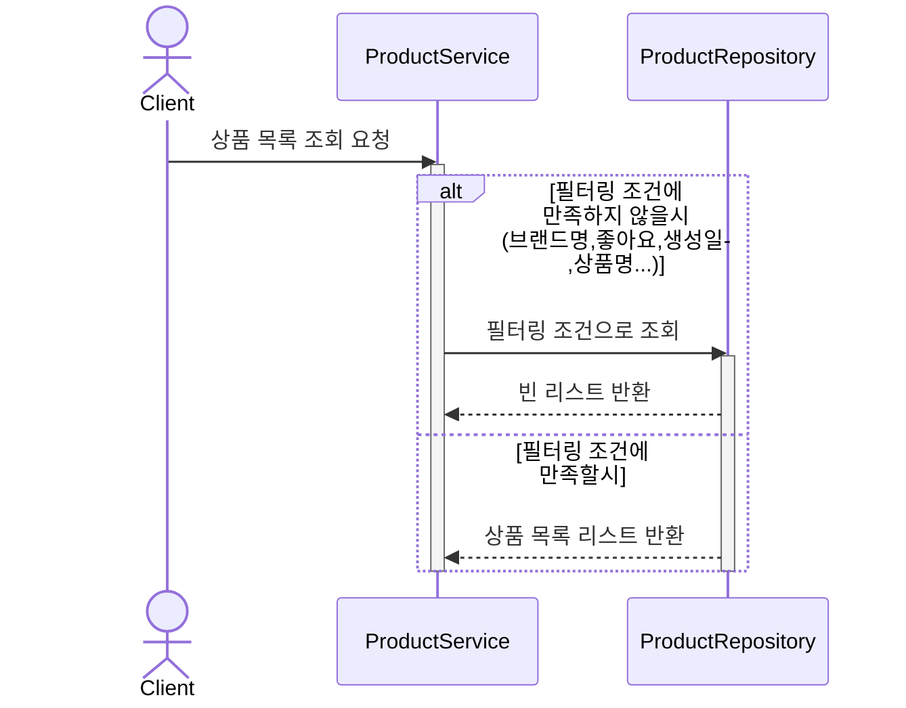
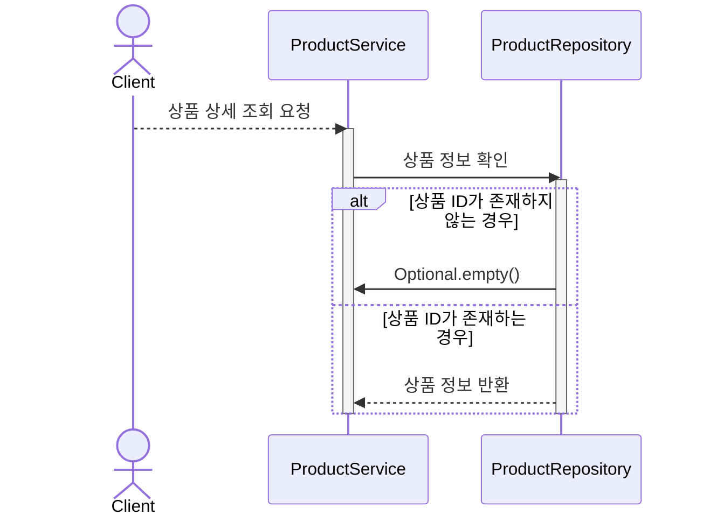
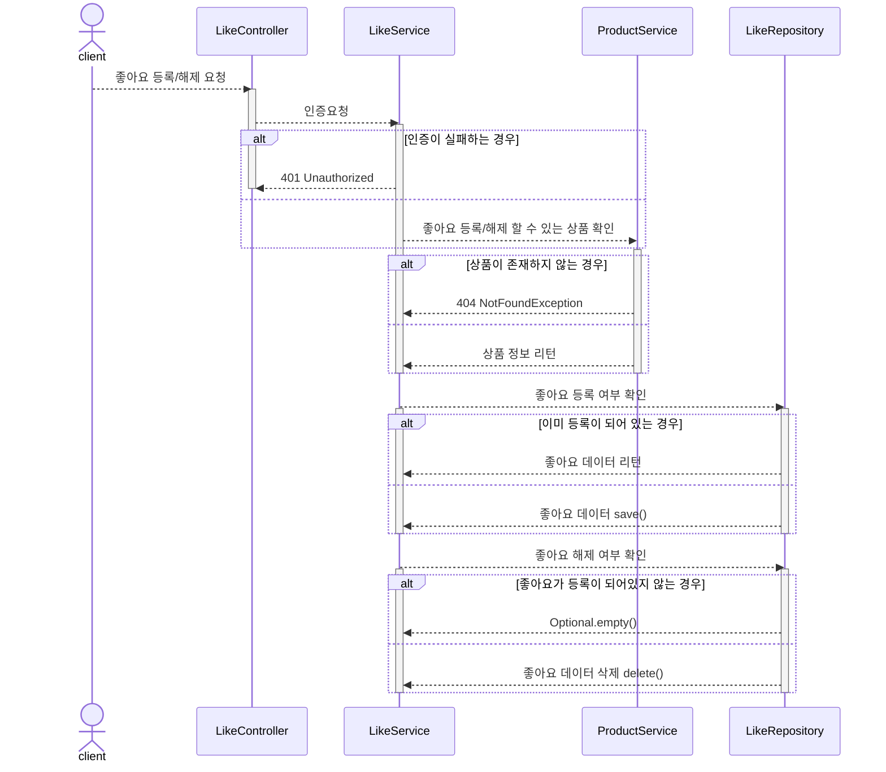
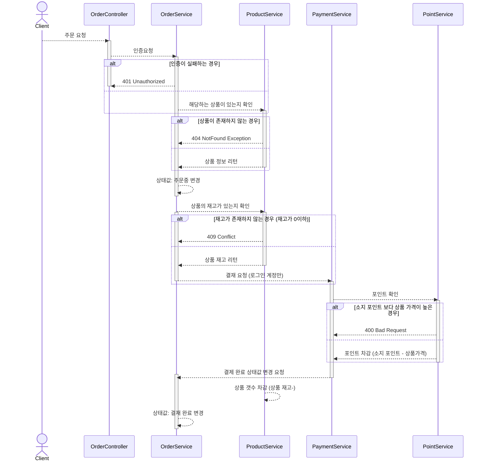
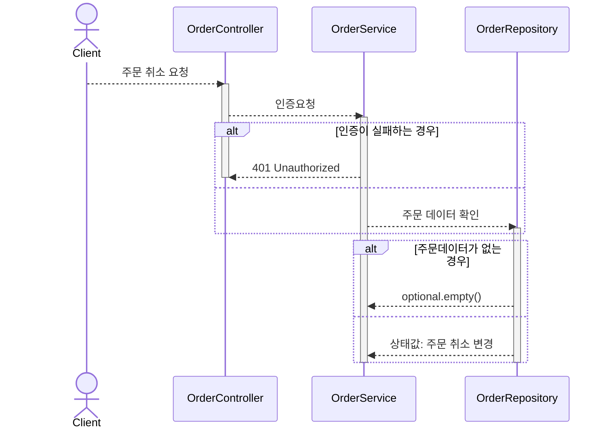

# 시퀀스 다이어그램

## 브랜드
### 브랜드 조회

```mermaid
sequenceDiagram
    actor U as Client
    participant BS as BrandService
    participant BP as BrandRepository
    participant PS as ProductService
    
    U -->> BS: 브랜드 조회
    activate BS
    BS -->> BP: 브랜드 정보 조회
    activate BP
    alt 브랜드가 존재하지 않음
    BP -->> BS: Optional.empty()

    else 브랜드가 존재함
    BP -->> BS: 브랜드 정보 반환
    deactivate BP
    deactivate BS
    end
    BS -->> PS: 상품 목록 조회
    activate BS
    activate PS
    alt 상품이 존재하지 않는 경우
        PS -->> BS: 빈 배열 리턴
    else 상품이 존재하는 경우
        PS -->> BS: 상품 목록 응답
    end
    deactivate BS
    deactivate PS
    
```
## 상품
### 상품 목록 조회

```mermaid

sequenceDiagram
   actor U as Client
   participant PS as ProductService
   participant PP as ProductRepository

   U ->> PS: 상품 목록 조회 요청
   activate PS
   alt 필터링 조건에 만족하지 않을시 (브랜드명,좋아요,생성일,상품명...)
      PS ->> PP: 필터링 조건으로 조회
   activate PP
      PP -->> PS: 빈 리스트 반환
   else 필터링 조건에 만족할시
      PP -->> PS: 상품 목록 리스트 반환
   end
   deactivate PP
   deactivate PS
```
### 상품 상세조회

```mermaid
sequenceDiagram
    actor U as Client
    participant PS as ProductService
    participant PP as ProductRepository
    
    U -->> PS: 상품 상세 조회 요청
    activate PS
    PS ->> PP: 상품 정보 확인         
    activate PP
    alt 상품 ID가 존재하지 않는 경우
    PP ->> PS: Optional.empty()
    else 상품 ID가 존재하는 경우
    PP -->> PS: 상품 정보 반환
    end
    deactivate PP
    deactivate PS
```

## 좋아요
### 좋아요 등록/해제

```mermaid
sequenceDiagram 
actor  C as client
participant LC AS LikeController
participant LS AS LikeService
participant PS AS ProductService
participant LR AS LikeRepository

C -->> LC: 좋아요 등록/해제 요청
activate LC
LC -->> LS: 인증요청
activate LS
alt 인증이 실패하는 경우 
LS -->> LC: 401 Unauthorized
deactivate LC
else
%% 상품이 존재하는지 조사
LS -->> PS: 좋아요 등록/해제 할 수 있는 상품 확인
end

activate PS
alt 상품이 존재하지 않는 경우 
PS -->> LS: 404 NotFoundException
else
PS -->> LS: 상품 정보 리턴    
end
deactivate LS
deactivate PS

%% 좋아요 등록
LS -->> LR: 좋아요 등록 여부 확인
activate LS
activate LR
alt 이미 등록이 되어 있는 경우
LR -->> LS: 좋아요 데이터 리턴
else
LR -->> LS: 좋아요 데이터 save()   
end
deactivate LR
deactivate LS

%% 좋아요 등록 해제
LS -->> LR: 좋아요 해제 여부 확인
activate LS
activate LR
alt 좋아요가 등록이 되어있지 않는 경우
LR -->> LS: Optional.empty()
else
LR -->> LS: 좋아요 데이터 삭제 delete()
end
deactivate LR
deactivate LS
```

## 주문/결제
### 주문 생성

```mermaid
sequenceDiagram
actor C as Client
participant OC as OrderController
participant OS as OrderService
participant PS as ProductService
participant PAS as PaymentService
participant POS as PointService

C -->> OC: 주문 요청
activate OC
OC -->> OS: 인증요청
    activate OS
alt 인증이 실패하는 경우
OS -->> OC: 401 Unauthorized
  deactivate OC
else
OS -->> PS: 해당하는 상품이 있는지 확인
  activate PS
end

alt 상품이 존재하지 않는 경우
PS -->> OS: 404 NotFound Exception
else
PS -->> OS: 상품 정보 리턴
  deactivate PS
end

    OS -->> OS: 상태값: 주문중 변경  
  deactivate OS

OS -->> PS: 상품의 재고가 있는지 확인
  activate OS
  activate PS
alt 재고가 존재하지 않는 경우 (재고가 0이하)
  PS -->> OS: 409 Conflict
else
  PS -->> OS: 상품 재고 리턴
  deactivate PS
  OS -->> PAS: 결재 요청 (로그인 계정만)
  deactivate OS
  activate PAS
end

PAS -->> POS: 포인트 확인
activate POS

alt 소지 포인트 보다 상품 가격이 높은 경우 
POS -->> PAS: 400 Bad Request
else
POS -->> PAS: 포인트 차감 (소지 포인트 - 상품가격)    
end
deactivate POS

PAS -->> OS: 결제 완료 상태값 변경 요청
activate OS
deactivate PAS
PS -->> PS: 상품 갯수 차감 (상품 재고-)
OS -->> OS: 상태값: 결재 완료 변경 
deactivate OS
```
### 주문 취소

```mermaid
sequenceDiagram
actor C as Client
participant OC as OrderController
participant OS as OrderService
participant OR as OrderRepository 
C -->> OC: 주문 취소 요청
activate OC
OC -->> OS: 인증요청
activate OS
alt 인증이 실패하는 경우
    OS -->> OC: 401 Unauthorized
    deactivate OC
else
    OS -->> OR: 주문 데이터 확인
    activate OR
end

alt 주문데이터가 없는 경우
     OR -->> OS: optional.empty()
else
    OR -->> OS: 상태값: 주문 취소 변경
end
deactivate OS
deactivate OR    
```
