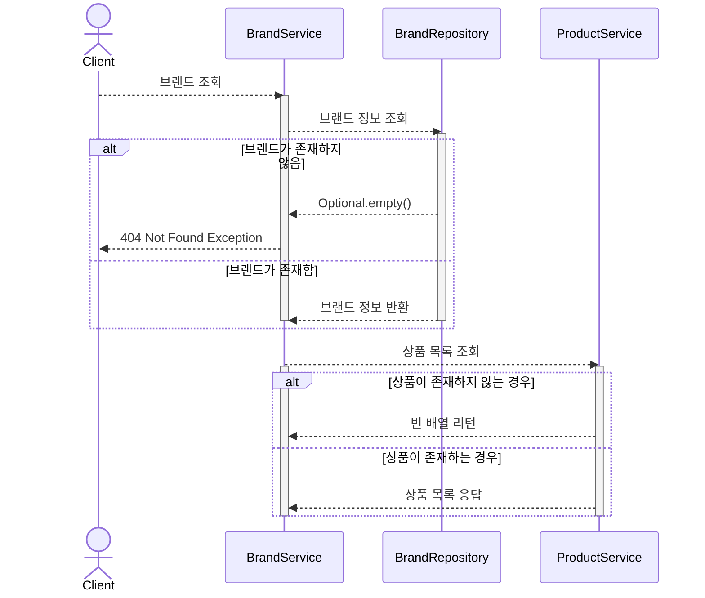
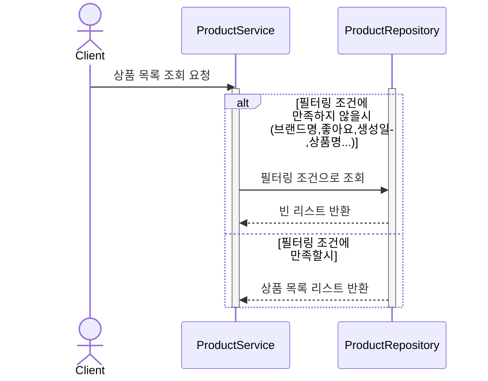
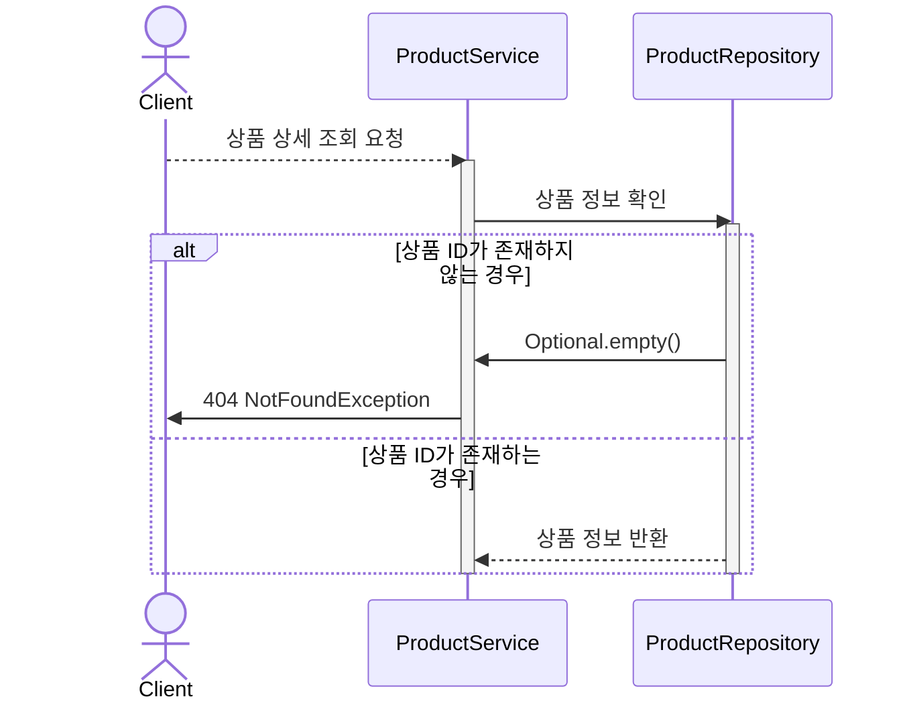

# 시퀀스 다이어그램

## 브랜드
### 브랜드 조회

```mermaid
sequenceDiagram
    actor U as Client
    participant BS as BrandService
    participant BP as BrandRepository
    participant PS as ProductService
    
    U -->> BS: 브랜드 조회
    activate BS
    BS -->> BP: 브랜드 정보 조회
    activate BP
    alt 브랜드가 존재하지 않음
    BP -->> BS: Optional.empty()
    BS -->> U: 404 Not Found Exception
    else 브랜드가 존재함
    BP -->> BS: 브랜드 정보 반환
    deactivate BP
    deactivate BS
    end
    BS -->> PS: 상품 목록 조회
    activate BS
    activate PS
    alt 상품이 존재하지 않는 경우
        PS -->> BS: 빈 배열 리턴
    else 상품이 존재하는 경우
        PS -->> BS: 상품 목록 응답
    end
    deactivate BS
    deactivate PS
    
```
## 상품
### 상품 목록 조회

```mermaid

sequenceDiagram
   actor U as Client
   participant PS as ProductService
   participant PP as ProductRepository

   U ->> PS: 상품 목록 조회 요청
   activate PS
   activate PP
   alt 필터링 조건에 만족하지 않을시 (브랜드명,좋아요,생성일,상품명...)
      PS ->> PP: 필터링 조건으로 조회
      PP -->> PS: 빈 리스트 반환
   else 필터링 조건에 만족할시
      PP -->> PS: 상품 목록 리스트 반환
   end
    deactivate PP
    deactivate PS
```
## 상품 상세조회

```mermaid
sequenceDiagram
    actor U as Client
    participant PS as ProductService
    participant PP as ProductRepository
    
    U -->> PS: 상품 상세 조회 요청
    activate PS
    PS ->> PP: 상품 정보 확인         
    activate PP
    alt 상품 ID가 존재하지 않는 경우
    PP ->> PS: Optional.empty()
    PS ->> U: 404 NotFoundException
    else 상품 ID가 존재하는 경우
    PP -->> PS: 상품 정보 반환
    end
    deactivate PP
    deactivate PS
```
