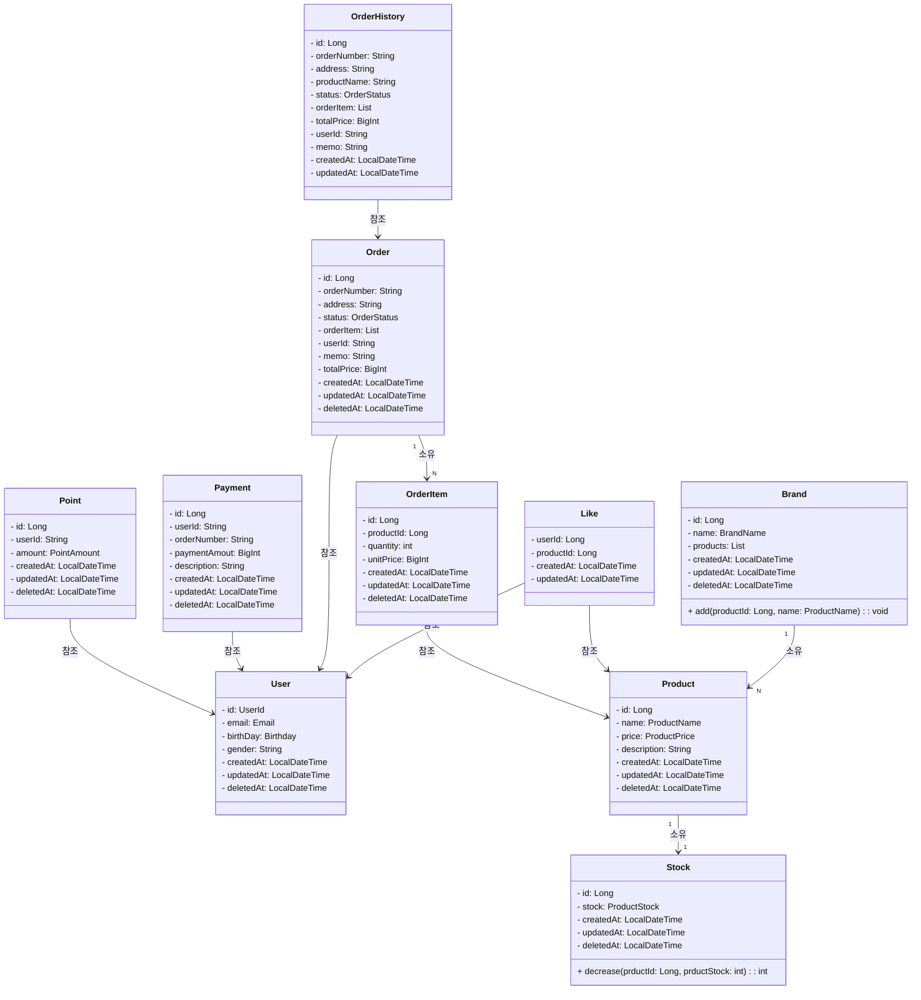

# 클래스 다이어그램

```mermaid
classDiagram

class User {
   - id: UserId
   - email: Email
   - birthDay: Birthday
   - gender: String
   - createdAt: LocalDateTime
   - updatedAt: LocalDateTime
   - deletedAt: LocalDateTime
}

class Like {
    - userId: Long
    - productId: Long
    - createdAt: LocalDateTime
    - updatedAt: LocalDateTime
}

class Brand {
    - id: Long
    - name: BrandName
    - products: List<Product>
    - createdAt: LocalDateTime
    - updatedAt: LocalDateTime
    - deletedAt: LocalDateTime
  
    + add(productId: Long, name: ProductName): void 
}

class Product {
    - id: Long
    - name: ProductName
    - price: ProductPrice
    - description: String
    - createdAt: LocalDateTime
    - updatedAt: LocalDateTime
    - deletedAt: LocalDateTime
}

class Stock { 
 - id: Long
 - stock: ProductStock
 - createdAt: LocalDateTime
 - updatedAt: LocalDateTime
 - deletedAt: LocalDateTime
 
 + decrease(prductId: Long, prductStock: int): int
}


class Order {
  - id: Long
  - orderNumber: String
  - address: String
  - status: OrderStatus
  - orderItem: List<OrderItem>
  - userId: String
  - memo: String
  - totalPrice: BigInt
  - createdAt: LocalDateTime
  - updatedAt: LocalDateTime
  - deletedAt: LocalDateTime
  
}


class OrderHistory { 
  - id: Long
  - orderNumber: String
  - address: String
  - productName: String
  - status: OrderStatus
  - orderItem: List<OrderItem>
  - totalPrice: BigInt
  - userId: String
  - memo: String
  
  - createdAt: LocalDateTime
  - updatedAt: LocalDateTime  
}

class OrderItem {
  - id: Long
  - productId: Long
  - quantity: int
  - unitPrice: BigInt
  - createdAt: LocalDateTime
  - updatedAt: LocalDateTime
  - deletedAt: LocalDateTime
}

class Payment { 
  - id: Long
  - userId: String
  - orderNumber: String
  - paymentAmout: BigInt
  - description: String
  - createdAt: LocalDateTime
  - updatedAt: LocalDateTime
  - deletedAt: LocalDateTime
}

class Point { 
  - id: Long
  - userId: String
  - amount: PointAmount
  - createdAt: LocalDateTime
  - updatedAt: LocalDateTime
  - deletedAt: LocalDateTime  
}

Brand "1" --> "N" Product : 소유
Like --> Product : 참조    
Like --> User : 참조

Order --> User : 참조
Order "1" --> "N" OrderItem : 소유

OrderHistory --> Order : 참조
OrderItem --> Product : 참조
Payment --> User : 참조
Point --> User : 참조

Product "1" --> "1" Stock : 소유

```
